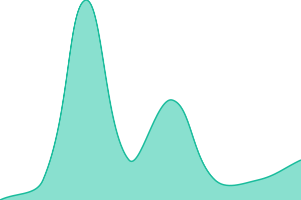

# [📈 Live Status](https://status.solynxnodes.fun): <!--live status--> **🟧 Partial outage**

This repository contains the open-source uptime monitor and status page for [orbitxd6969-jpg](https://status.solynxnodes.fun), powered by [Upptime](https://github.com/upptime/upptime).

With [Upptime](https://upptime.js.org), you can get your own unlimited and free uptime monitor and status page, powered entirely by a GitHub repository. We use [Issues](https://github.com/orbitxd6969-jpg/status-page/issues) as incident reports, [Actions](https://github.com/orbitxd6969-jpg/status-page/actions) as uptime monitors, and [Pages](https://status.solynxnodes.fun) for the status page.

<!--start: status pages-->
<!-- This summary is generated by Upptime (https://github.com/upptime/upptime) -->
<!-- Do not edit this manually, your changes will be overwritten -->
<!-- prettier-ignore -->
| URL | Status | History | Response Time | Uptime |
| --- | ------ | ------- | ------------- | ------ |
|  [Control Panel](https://cpanel.solynxnodes.fun) | 🟩 Up | [control-panel.yml](https://github.com/orbitxd6969-jpg/status-page/commits/HEAD/history/control-panel.yml) | 

 1206ms
     
 | 

<a href="https://status.solynxnodes.fun/history/control-panel">81.15%</a>
    

|  [Website](https://solynxnodes.fun) | 🟩 Up | [website.yml](https://github.com/orbitxd6969-jpg/status-page/commits/HEAD/history/website.yml) | 

 605ms
     
 | 

<a href="https://status.solynxnodes.fun/history/website">100.00%</a>
    

|  [Node-1 (IN)](india-1.solynxnodes.fun) | 🟥 Down | [node-1-in.yml](https://github.com/orbitxd6969-jpg/status-page/commits/HEAD/history/node-1-in.yml) | 

 0ms
     
 | 

<a href="https://status.solynxnodes.fun/history/node-1-in">0.00%</a>
    

|  [Free Node](free-1.solynxnodes.fun) | 🟩 Up | [free-node.yml](https://github.com/orbitxd6969-jpg/status-page/commits/HEAD/history/free-node.yml) | 

 6ms
     
 | 

<a href="https://status.solynxnodes.fun/history/free-node">65.19%</a>
    

<!--end: status pages-->

[**Visit our status website →**](https://status.solynxnodes.fun)

## 📄 License

- Powered by: [Upptime](https://github.com/upptime/upptime)
- Code: [MIT](./LICENSE) © [Anand Chowdhary](https://anandchowdhary.com), supported by [Pabio](https://pabio.com)
- Data in the `./history` directory: [Open Database License](https://opendatacommons.org/licenses/odbl/1-0/)
